<h1>Práctica 1</h1>

Luis Miguel Aguilar González (https://github.com/laguilarg99/PDIH/)

Francisco Álvarez Terribas (https://github.com/Iqqdd99/PDIH)

<div style="text-align: justify">
Después de haber profundizado en los dos primeros seminarios quedando claro el uso de DOSBOX, su configuración y las llamadas a las interrupciones en C para E/S tenemos todas las herramientas necesarias para realizar esta primera práctica. En ella se proponen la programación de 9 funciones básicas y 2 funciones extra que cuentan con un nivel superior de dificultad.   
</div>

<h4>void mi_pausa(void);</h4>

<div style="text-align: justify">
A continuación se puede ver la función encargada de realizar una pausa antes de seguir con la ejecución del programa:
</div>

```Bash
// hace una pausa
void mi_pausa(void){
    union REGS inregs, outregs;
    inregs.h.ah = 0x00;
    int86(0x16, &inregs, &outregs);
}

```
<div style="text-align: justify">
En la siguiente captura de pantalla se puede ver como efetivamente se produce la pausa a la espera de la pulsación de una tecla:
</div>

_ _ _ _

<div style="text-align:center">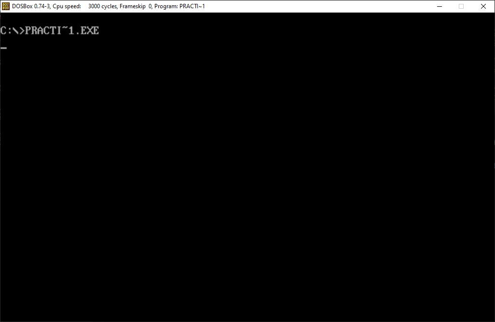</div>

_ _ _ _

<h4>void mi_gotoxy(int x, int y);</h4>

<div style="text-align: justify">
A continuación se puede ver la función encargada de mover el cursor a una posición pasada como parámetro:
</div>

```Bash
void mi_gotoxy(int x, int y){
    union REGS inregs, outregs;

    inregs.h.ah = 2;
    inregs.h.dh = x; //Posicion del cursor x
    inregs.h.dl = y; //Posicion del cursor y
    inregs.h.bh = 0;

    int86(0x10, &inregs, &outregs);
}

```
<div style="text-align: justify">
En la siguiente captura de pantalla se puede ver como efetivamente pone el cursor en la posición ejemplo (5,5):
</div>

_ _ _ _

<div style="text-align:center">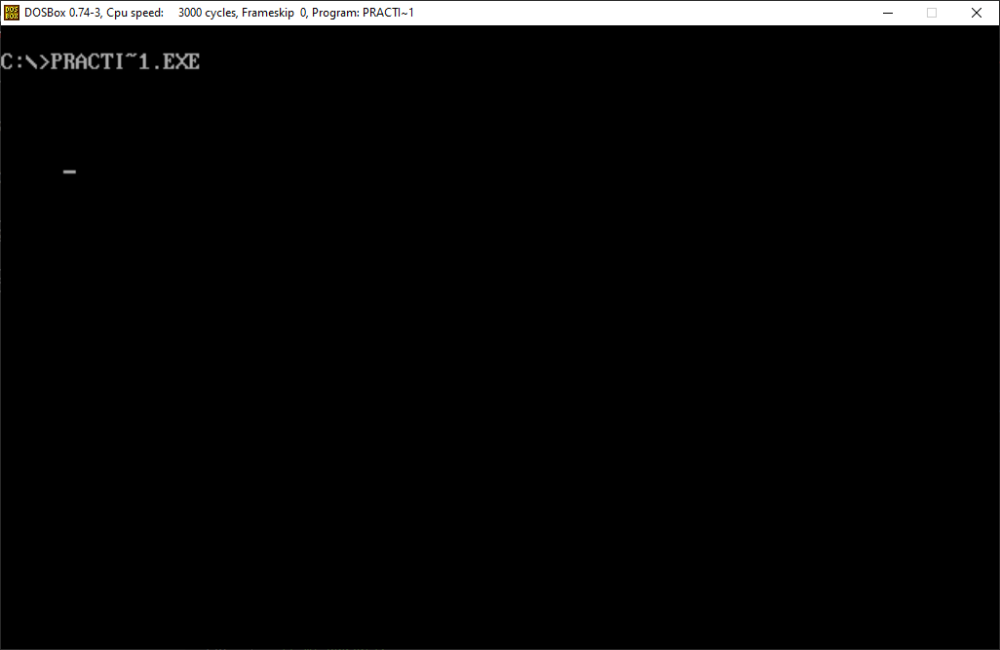</div>

_ _ _ _

<h4>void mi_setcursortype(int tipo_cursor);</h4>

<div style="text-align: justify">
A continuación se puede ver la función encargada de cambiar el tipo de cursor puduiendo seleccionar 3 diferentes (Invisible:0, Normal:1, Grueso:2):
</div>

```Bash
//establece el tipo de cursor
void setcursortype(int tipo_cursor){
    union REGS inregs, outregs;	 	 	 	 																																		
    inregs.h.ah = 0x01;
    
    switch(tipo_cursor){
        case 0: //invisible
            inregs.h.ch = 010;
            inregs.h.cl = 000;
        break;

        case 1: //normal
            inregs.h.ch = 010;
            inregs.h.cl = 010;
        break;
        
        case 2: //grueso
            inregs.h.ch = 000;
            inregs.h.cl = 010;
        break;

        default: return -1;
    }
    
    int86(0x10, &inregs, &outregs);
}

```
<div style="text-align: justify">
En la siguiente captura de pantalla se puede ver como efetivamente cambia el tipo de cursor a grueso:
</div>

_ _ _ _

<div style="text-align:center">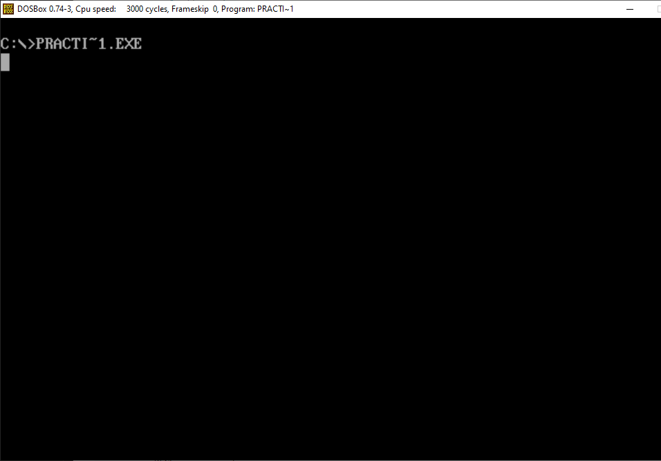</div>

_ _ _ _

<h4>void mi_setvideomode(BYTE modo);</h4>

<div style="text-align: justify">
A continuación se puede ver la función encargada de cambiar el modo de video al igual que en el seminario 2:
</div>

```Bash
// establece el modo de vídeo: 3-texto, 4-gráfico
void mi_setvideomode(BYTE modo){
    union REGS inregs, outregs;
    inregs.h.ah = 0x00;
    inregs.h.al = modo;
    int86(0x10, &inregs, &outregs);
}


```
<div style="text-align: justify">
En la siguiente captura de pantalla se puede ver como efetivamente cambia el modo de video:
</div>

_ _ _ _

<div style="text-align:center">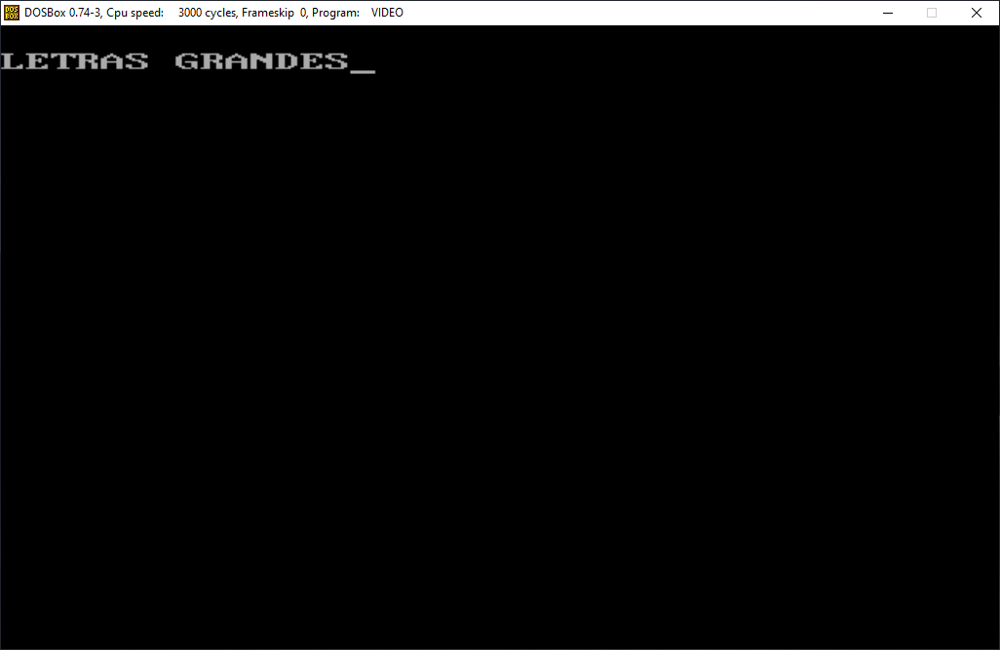</div>

_ _ _ _

<h4>int mi_getvideomode(void);</h4>

<div style="text-align: justify">
A continuación se puede ver la función encargada devolver el modo de video actual:
</div>

```Bash

// devuelve el modo 
int mi_getvideomode(){ 
    union REGS inregs, outregs;
    int videomode;
    inregs.h.ah = 0x0F; 	 	 	 																											
    int86(0x10, &inregs, &outregs);
    videomode = outregs.h.al;
    return videomode;
}


```
<div style="text-align: justify">
En la siguiente captura de pantalla se puede ver como efetivamente devuelve el modo de video:
</div>

_ _ _ _

<div style="text-align:center">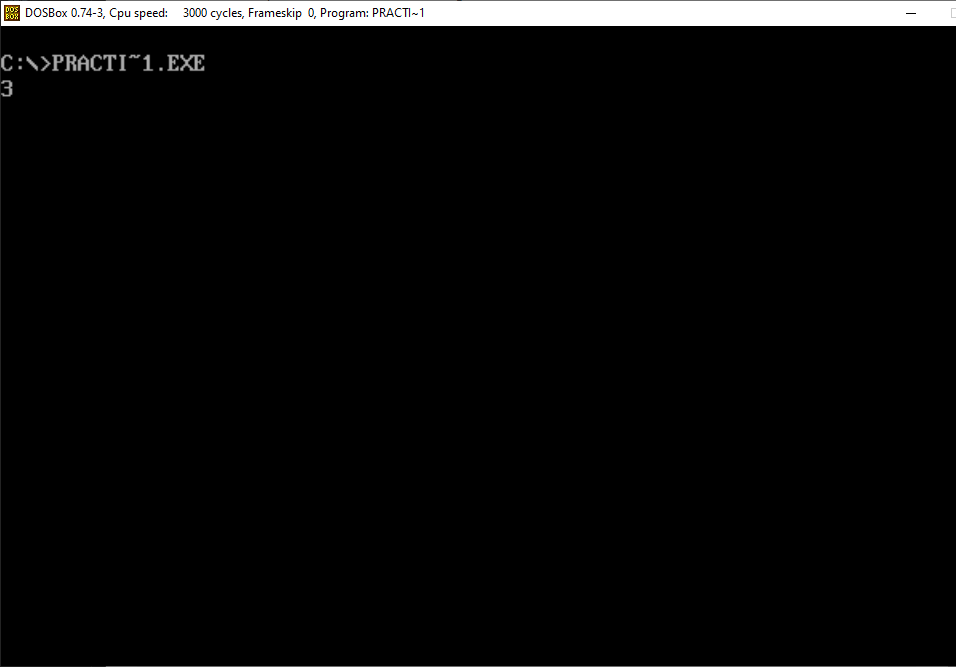</div>

_ _ _ _

<h4>void mi_textcolor(unsigned char ctexto);</h4>

<div style="text-align: justify">
A continuación se puede ver la función encargada modificar el color de texto almacenado en una variable del programa llamada _color_texto:
</div>

```Bash


// modifica el color de primer plano con que se mostrarán los caracteres
void mi_textcolor(int color){
    _color_texto = color;
}


```
<div style="text-align: justify">
En la siguiente captura de pantalla se puede ver como efetivamente cambia el color de los caracteres haciendo uso de mi_cputchar
</div>

_ _ _ _

<div style="text-align:center">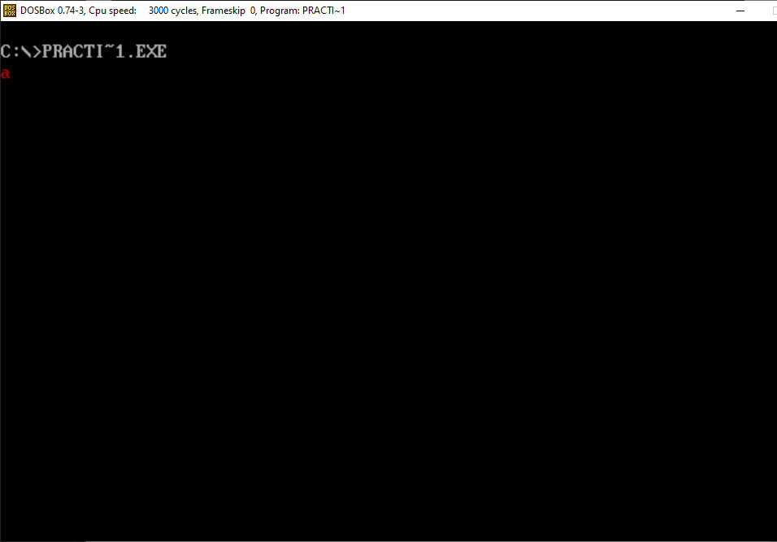</div>

_ _ _ _

<h4>void mi_textbackground(unsigned char cfondo);</h4>

<div style="text-align: justify">
A continuación se puede ver la función encargada modificar el color de fondo del texto almacenado en una variable del programa llamada _color_fondo:
</div>

```Bash


// modifica el color de fondo con el que se mostrarán los caracteres
void textbackground(int color){
    _color_fondo = color;
}


```
<div style="text-align: justify">
En la siguiente captura de pantalla se puede ver como efetivamente cambia el color de fondo de los caracteres haciendo uso de mi_cputchar además del color del texto:
</div>

_ _ _ _

<div style="text-align:center">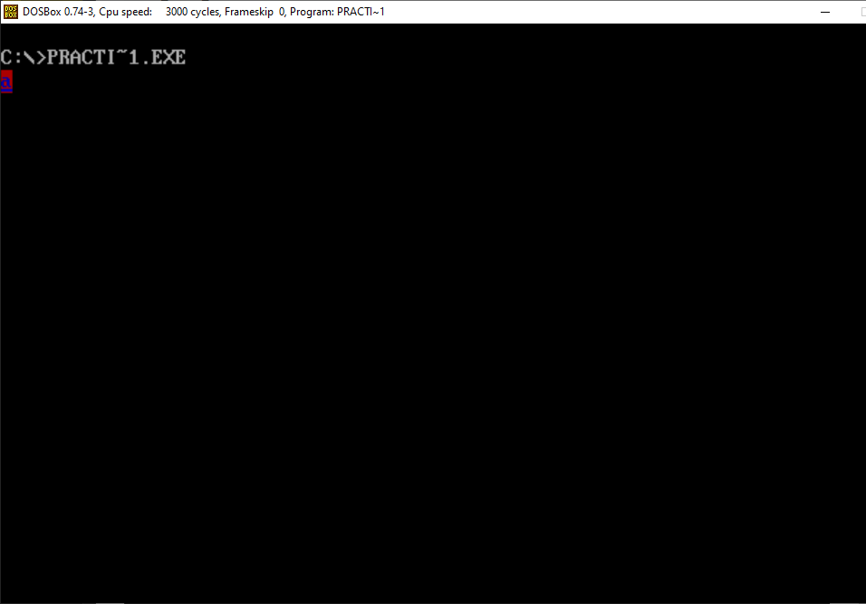</div>

_ _ _ _

<h4> void mi_cputchar(char letra); </h4>

<div style="text-align: justify">
Esta es nuestra implementación de mi_cputchar, su utilidad ya se ha visto en los apartados anteriores:
</div>


    //escribe un carácter en pantalla con el color indicado actualmente
    void mi_cputchar(char letra){
        union REGS inregs, outregs;
        inregs.h.ah = 0x09;
        inregs.h.al = letra;
        inregs.h.bl = _color_fondo << 4 | _color_texto;
        inregs.h.bh = 0x00;
        inregs.x.cx = 1;
        int86(0x10, &inregs, &outregs);
        return;
    }

_ _ _ _

<h4> void mi_clscr(void); </h4>

<div style="text-align: justify">
Esta función se encarga de limpiar la pantalla, su utilidad se verá más clara en los ejercicios extra.
</div>

    void mi_clscr(void){
        union REGS inregs, outregs;
        inregs.h.ah = 0x06;
        inregs.h.al = 0;
        inregs.h.dh = 25;
        inregs.h.dl = 80;
        inregs.h.bh = 0x00;
        inregs.x.cx = 0x00;
        int86( 0x10, &inregs, &outregs );
        
        mi_setvideomode(3);
    }

_ _ _ _

<h4> void mi_getche(void); </h4>

<div style="text-align: justify">
Esta función obtiene un carácter de teclado y lo muestra por pantalla:
</div>

    void mi_getche(void){
        int tmp;

        printf("\nPulsa una tecla: ");
        tmp = mi_getchar();
        
        printf("\nHas pulsado: ");
        mi_putchar( (char)tmp);

    }

_ _ _ _

<div style="text-align:center">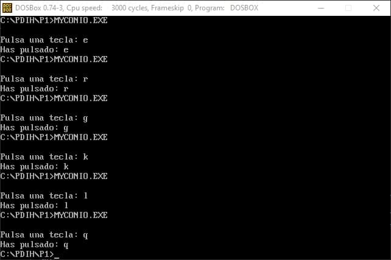</div>

_ _ _ _


<h2> Ejercicios extra </h2>

_ _ _ _

<h3> Dibujar cuadrados </h3>
<div style="text-align: justify">
En este primer ejercicio se busca hacer una función que permita dibujar un recuadro en pantalla en modo texto dándole como parámetros las coordenadas superior izquierda e inferior derecha del recuadro, el color de primer plano y el color de fondo.
</div>

    void modoTextoRecuadro(int l_x, int l_y, int r_x, int r_y, unsigned char ctexto, unsigned char cfondo){

        int i;
        char myChar = ' ';

        //Cambiar color del texto
        mi_textcolor(ctexto);
        mi_textbackground(cfondo);

        //Dibujar arista superior 
        for(i = l_x; i<r_x-1; i++){       
            mi_gotoxy(i,l_y);
            mi_cputchar(myChar);
        }

        //Dibujar laterales
        for(i = l_y; i<r_y; i++){       
            mi_gotoxy(r_x-1,i);
            mi_cputchar(myChar);
            mi_gotoxy(l_x,i);
            mi_cputchar(myChar);
        }

        //Dibujar arista inferior
        for(i = l_x; i<r_x-1; i++){       
            mi_gotoxy(i,r_y-1);
            mi_cputchar(myChar);
        }
    }

<div style="text-align: justify">
Aquí en este ejemplo podemos ver como podemos dibujar recuadros de distintos tamaños dependiendo de las coordenadas que le pasemos a la función:
</div>
_ _ _ _

<div style="text-align:center">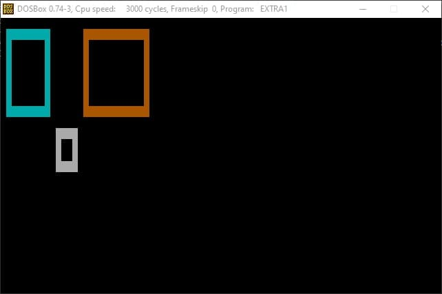</div>


_ _ _ _

<h3> Dibujos básicos en modo VGA 256 </h3>

_ _ _ _

<div style="text-align: justify">
Ahora vamos a mostrar una serie de funciones que realizan dibujos basicos en este modo.
</div>

_ _ _ _

<h4>void dibujos_sencillos(void); </h4>


<div style="text-align: justify">
En primer lugar tenemos este ejemplo que hemos usado para familiarizarnos con el modo de vídeo VGA 256, lo encontramos en la web http://www.brackeen.com/vga/source/bc31/pixel.c.html. Su cometido es dibujar una serie de puntos de color y posición aleatoria por toda la pantalla.
</div>

    void plot_pixel_slow(int x,int y,BYTE color){
    
    union REGS inregs, outregs;

    inregs.h.ah = WRITE_DOT;
    inregs.h.al = color;
    inregs.x.cx = x;
    inregs.x.dx = y;

    int86(VIDEO_INT, &inregs, &outregs);

    }

    void dibujos_sencillos(void){
        int x,y,color,i;
        
        mi_setvideomode(VGA_256_COLOR_MODE);
        
        for(i=0;i<30000L;i++)               
        {
            x=rand()%SCREEN_WIDTH;
            y=rand()%SCREEN_HEIGHT;
            color=rand()%NUM_COLORS;
            plot_pixel_slow(x,y,color);
        }

        mi_pausa();
    }

<div style="text-align:center">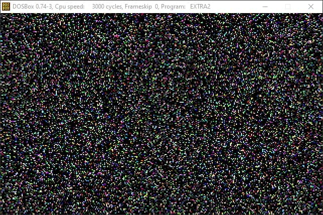</div>

_ _ _ _
<h4>void dibujos_sencillos2(void); </h4>


<div style="text-align: justify">
La primera función que implementamos fue esta, dicha función dibuja lineas horizontales de distintos colores y al terminar dibuja un triángulo negro.
</div>

    void dibujos_sencillos2(void){
        int x,y,color,i,j;
        int centro = 320/2;

        mi_setvideomode(VGA_256_COLOR_MODE);

        for(i = 0; i < 200; i++){

            color = rand()%NUM_COLORS;

            for(j = 0; j < 320; j++){
                plot_pixel_slow(j,i,color);
            }
        }

        for(i = 0; i < 200; i++){

            color = rand()%NUM_COLORS;

            for(j = 0; j < 320; j++){
                if (j == centro-i){
                    plot_pixel_slow(j,i,0);
                    plot_pixel_slow(j-1,i,0);
                } 
                
                if ( j == centro+1+i){
                    plot_pixel_slow(j,i,0);
                    plot_pixel_slow(j-1,i,0);
                }

                if(i == 100){
                    plot_pixel_slow(j,i,0);
                }
            }
        }
    }

<div style="text-align:center">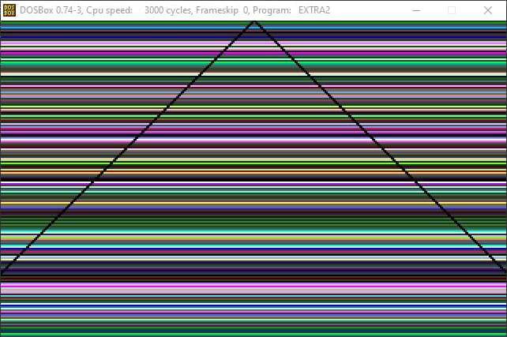</div>

_ _ _ _

<h4>void dibujos_sencillos3(void); </h4>


<div style="text-align: justify">
Esta función en su caso base dibuja un recuadro de la misma forma que se hacía en modo texto para el ejercicio extra 1, la principal diferencia es que dicha función realiza una llamada recursiva a sí misma y además los colores con los que dibuja van cambiando conforme va dibujando.
</div>

    void dibujos_sencillos3(int l_x, int l_y, int r_x, int r_y){
        int x,y,i,j;
        int pixels = 320*200;
        int color_start = 32, color_limit = 16, color = 0;


        if(r_x - l_x <=0){
            return 0;
        }

        j = l_y;

        for(i = l_x; i<r_x+1; i++){
            plot_pixel_slow(i,j,color+color_start);
            plot_pixel_slow(i,r_y,color+color_start);
            color++;
            color = color%color_limit;
        }

        for(j = l_y; j<r_y+1; j++){
            plot_pixel_slow(i,j,color+color_start);
            plot_pixel_slow(l_y,j,color+color_start);
            color++;
            color = color%color_limit;
        }

        dibujos_sencillos3(l_x+1,l_y+1,r_x-1,r_y-1);

    }

<div style="text-align:center">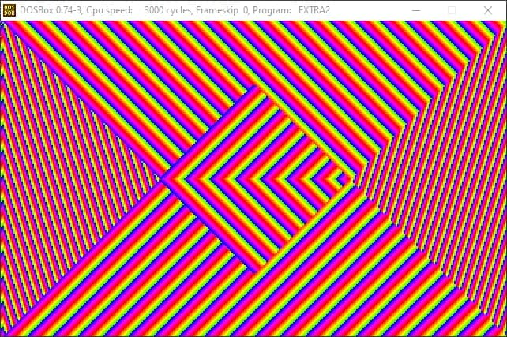</div>

_ _ _ _

<h4>void dibujos_sencillos4(void); </h4>


<div style="text-align: justify">
Esta función en términos generales funciona exactamente igual que la anterior, la única diferencia es que el color con el que se dibuja solo se modifica al realizar una llamada recursiva, por tanto el resultado es que dibuja cuadrados concéntricos
</div>

    void dibujos_sencillos4(int l_x, int l_y, int r_x, int r_y, int in_color){
    int x,y,i,j;
    int pixels = 320*200;
    int color_start = 32, color_limit = 16, color = 0;


    if(r_y - l_y <= 0){
        return 0;
    }

    j = l_y;

    for(i = l_x; i<r_x+1; i++){
        plot_pixel_slow(i,j,in_color+color_start);
        plot_pixel_slow(i,r_y,in_color+color_start);
    }

    for(j = l_y; j<r_y+1; j++){
        plot_pixel_slow(i,j,in_color+color_start);
        plot_pixel_slow(l_y,j,in_color+color_start);
    }

    in_color++;
    in_color = in_color%color_limit;

    dibujos_sencillos4(l_x+1,l_y+1,r_x-1,r_y-1,in_color);

}


<div style="text-align:center">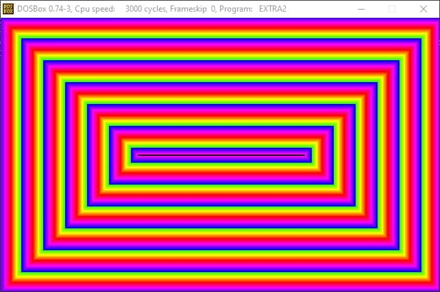</div>

_ _ _ _
