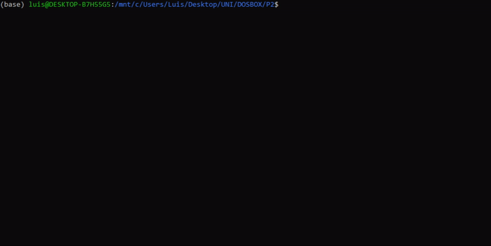

<h1>Práctica 2</h1>

Luis Miguel Aguilar González

Francisco Álvarez Terribas 

<div style="text-align: justify">
La primera parte de esta segunda práctica trata la instalación de la librería ncurses, cuyo uso es crucial para la realización de la segunda parte, no tenemos captura de pantalla de la instalación pues el proceso es realmente simple en Linux y lo hicimos en clase, siendo este la simple ejecución del comando que muestro a continuación (aunque no usamos Linux como sistema operativo anfitrión, funciona igualmente en el subsistema de Linux en Windows):
</div>
<br/>

```Bash
sudo apt-get install libncurses5-dev libncursesw5-dev
```
_ _ _ _

<div style="text-align: justify">
La segunda parte es básicamente la programación del famoso juego PONG donde aparecerá una primera pantalla en la que se muestran los controles de cada jugador y pasado un tiempo (expecificado por la macro DELAY) se iniciará el juego. La bola aparece siempre en mitad del terminal en el comienzo de la partida o cuando se ha marcado un punto por cualquiera de los jugadores. A continuación se puede observar la completa ejecución del programa:
</div>
<br/>

<div style="text-align: center"></div>

