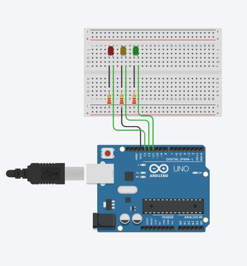
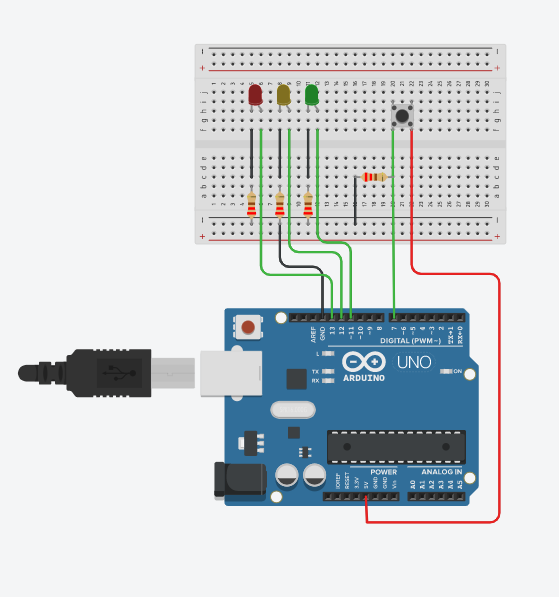
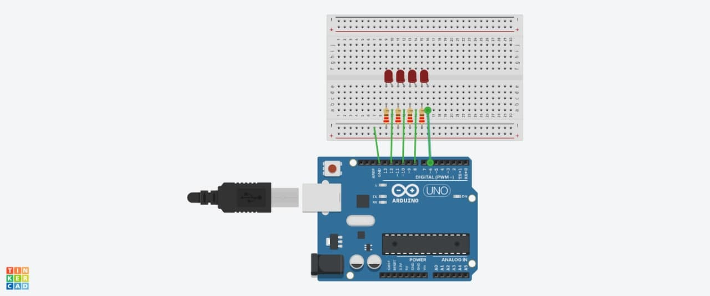
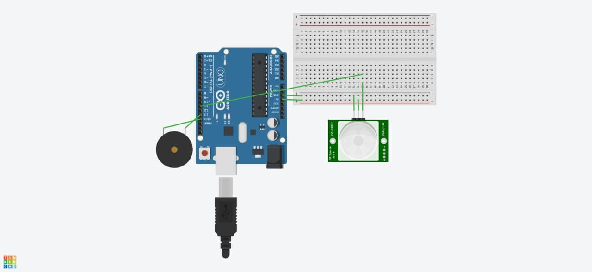

<h1>Práctica 3</h1>

Luis Miguel Aguilar González

Francisco Álvarez Terribas 

<div style="text-align: justify">
Esta tercera práctica trata de enseñar como crear proyectos con el propio Arduino o con los distintos simuladores propuestos, en nuestro caso usaremos Tinkercad como ya hicimos en el seminario para de esta forma poder hacer nuestros propios diseños e implementar los ejercicios propuestos.<br/>

El primero trata simplemente de colocar 3 leds, uno rojo, otro amarillo y un último verde a los puertos 13, 12  y 11 para luego hacer que funcionen de forma intermitente, quedando el código y el circuito (en él se han usado tres leds de los colores indicados y tres resistencias de 220 ohmios una para cada uno) como se muestra a continuación respectivamente:
</div>

<br/>

```C

void setup()
{
  pinMode(13, OUTPUT);
  pinMode(12, OUTPUT);
  pinMode(11, OUTPUT);
  
}


void loop()
{
  
    	digitalWrite(13, HIGH);
    	delay(1500);
   		digitalWrite(13, LOW);
  
    	digitalWrite(12,HIGH);
        delay(1500);
        digitalWrite(12, LOW);
  
        digitalWrite(11, HIGH);
        delay(1500);
        digitalWrite(11, LOW);
}
```
<br/>

<div style="text-align: center"></div>

<br/>

_ _ _ _

<div style="text-align: justify">
El segundo ejercicio, trata de que a través del uso de un pulsador conectado al pin 7 del Arduino (declarado como entrada), se encienda un led rojo y se apaguen el amarillo y el verde, para la realización de dicho ejercicio hemos realizado el código y el circuito (en él se han usado el propio pulsador, el led que enciende, los otros dos leds que apaga y cuatro resistencias de 220 ohmios una para cada uno de los otros componentes indicados) que se proponen a continuación respectivamente:
</div>
<br/>


```C


void setup()
{
  pinMode(7, INPUT);
  pinMode(13, OUTPUT);
  pinMode(12, OUTPUT);
  pinMode(11, OUTPUT);
  
}


void loop()
{
  
  int val = digitalRead(7);

  digitalWrite(13, val);
  digitalWrite(12, !val);
  digitalWrite(11, !val);
   
}

```
<br/>

<div style="text-align: center"></div>

<br/>

_ _ _ _

<div style="text-align: justify">
El tercer ejercicio (optativo), trata de que se conecten 4 leds para recrear las luces del coche fantástico, a continuación se proponen el código y el circuito (compuesto por 4 leds rojos y 4 resistencias de 220 ohmios) respectivamente para resolver el problema:
</div>
<br/>


```C

const unsigned int delay_time = 200;
unsigned int i;
void setup()
{
  pinMode(12, OUTPUT);
  pinMode(10, OUTPUT);
  pinMode(8, OUTPUT);
  pinMode(6, OUTPUT);
}

void loop()
{
  for(int i = 6; i < 12; i+=2){
    delay(delay_time);
    digitalWrite(i, HIGH);
    delay(delay_time); 
    digitalWrite(i, LOW);
  }
  
  for(int i = 12; i > 6 ; i-=2){
    delay(delay_time);
    digitalWrite(i, HIGH);
    delay(delay_time); 
    digitalWrite(i, LOW);
  }
}

```
<br/>

<div style="text-align: center"></div>

<br/>

_ _ _ _

<div style="text-align: justify">
El último ejercicio (opcional), trata de crear una alarma de movimiento, para ello se han propuesto el código y el circuito (compuesto por un zumbador piezoeléctrico y un sensor) que se muestran a continuación respectivamente:
</div>
<br/>


```C

unsigned int val = 0;

void setup()
{
  pinMode(13, OUTPUT);
  pinMode(11, INPUT);
}

void loop()
{
  val = digitalRead(11);
  digitalWrite(13, val);
}

```
<br/>

<div style="text-align: center"></div>
