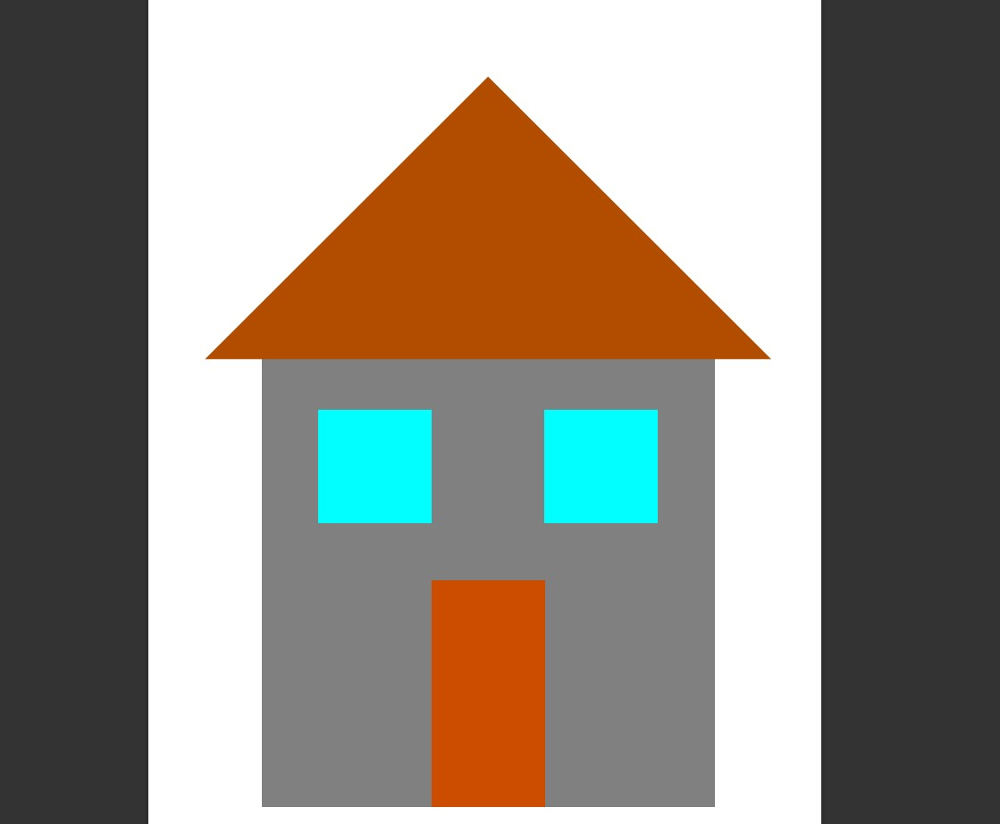
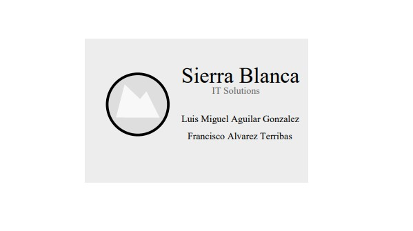

# Práctica 4

## Introducción al lenguaje PostScript

En esta práctica hemos implementado un dibujo básico de una casa y una tarjeta de visita en lenguaje PostScript.

Una vez escrito el código lo hemos convertido a pdf con el comando ps2pdf:

```Bash
        ps2pdf casa.ps
        ps2pdf tarjeta_visita.ps
```

Una vez hecho esto podemos visualizar los archivos pdf con nuestro lector preferido: 


