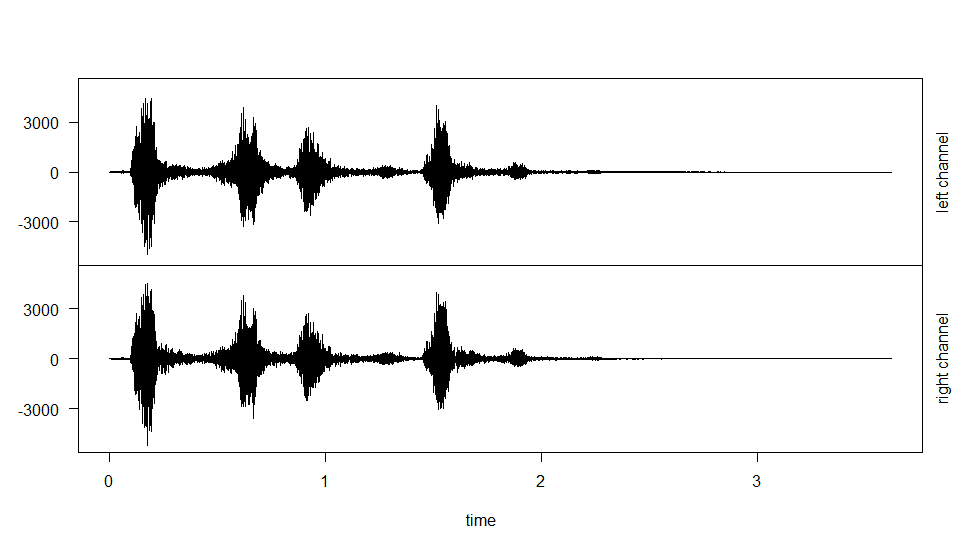
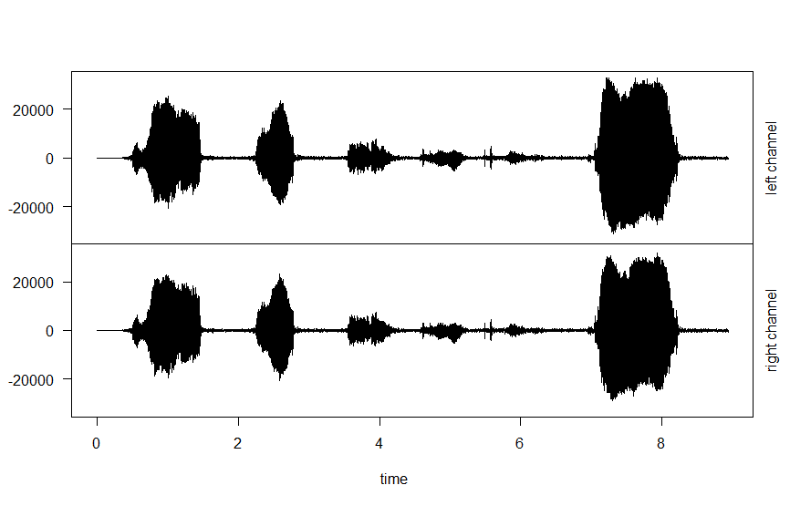
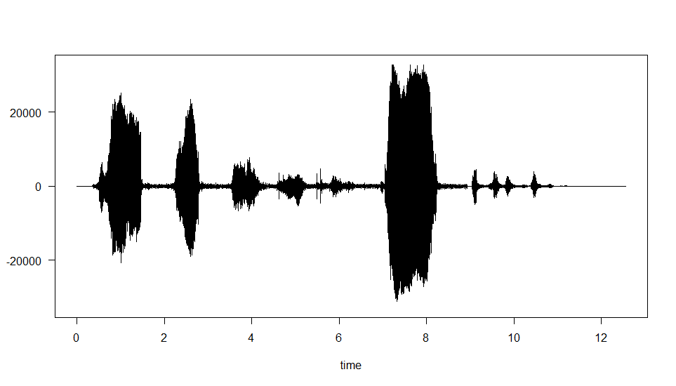
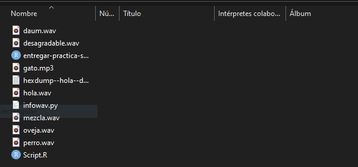
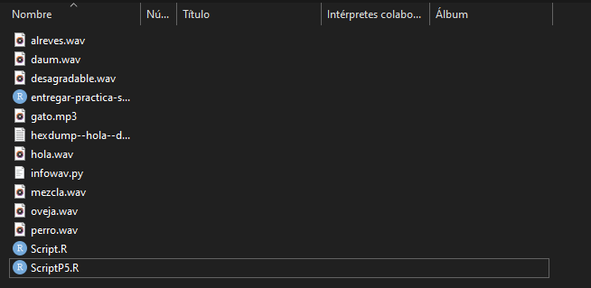

<h1>Práctica 5</h1>

Luis Miguel Aguilar González

Francisco Álvarez Terribas 

<div style="text-align: justify">
Esta quinta práctica trata modificar ficheros de audio con ayuda de las librerías que proporciona R.<br/>

El primero simplemente de leer dos ficheros de sonido yua sean WAV o MP3:
</div>


<br/>

```R
#Loading libraries
library(tuneR)
library(seewave)
library(audio)

#Loading audio files
perro <- readWave('perro.wav')
perro
gato <- readMP3('gato.mp3')
gato

```
<br/>

_ _ _ _

<br/>

<div style="text-align: justify">
El segundo ejercicio, trata de que después de haber cargado dichos sonidos dibujemos la forma de onda de cada uno:
</div>
<br/>

```R
#Plotting waves
plot( extractWave(perro, from = 1, to = 159732) )
plot( extractWave(gato, from = 1, to = 393984) )
```

<div style="text-align: justify">
Siendo el resultado el siguiente mostrando las ondas del perro y el gato respectivamente:

</div>
<br/>

<div style="text-align: center"></div>

<br/>

<br/>

<div style="text-align: center"></div>

<br/>

_ _ _ _

<div style="text-align: justify">
El tercer ejercicio por su parte pide obtener las cabeceras de los ficheros de sonido:

</div>
<br/>


```R

str(perro)
str(gato)

```

<br/>

<div style="text-align: justify">
Obteniendo el siguiente resultado:

</div>
<br/>

```
Formal class 'Wave' [package "tuneR"] with 6 slots
  ..@ left     : int [1:159732] 0 0 0 0 0 0 0 0 1 1 ...
  ..@ right    : int [1:159732] 0 0 0 0 0 0 0 0 1 1 ...
  ..@ stereo   : logi TRUE
  ..@ samp.rate: int 44100
  ..@ bit      : int 16
  ..@ pcm      : logi TRUE
Formal class 'Wave' [package "tuneR"] with 6 slots
  ..@ left     : int [1:393984] 0 0 0 0 0 0 0 0 0 0 ...
  ..@ right    : int [1:393984] 0 0 0 0 0 0 0 0 0 0 ...
  ..@ stereo   : logi TRUE
  ..@ samp.rate: num 44100
  ..@ bit      : num 16
  ..@ pcm      : logi TRUE
```

<br/>

_ _ _ _

<div style="text-align: justify">
El cuarto y quinto ejercicio piden unir ambos sonidos y dibujar su forma de onda:
</div>
<br/>


```R

#Union
s1 <- pastew(perro, gato, output="Wave")
plot( extractWave(s1, from = 1, to = 553716 ))

```
<br/>

<div style="text-align: center"></div>

_ _ _ _

<div style="text-align: justify">
El sexto y séptimo ejercicio tratan de pasar un filtro de frecuencia a la muestra resultante en la operación anterior para finalmente guardarla en el fichero mezcla.wav:
</div>
<br/>


```R
f <- 44100

#Delete frequencies
sndF1 <- bwfilter(s1, f=f, channel = 1, n = 1, from=10000, to=20000, bandpass =  TRUE, listen = FALSE, output= "Wave")
listen(sndF1, f = f)

#Save
writeWave(sndF1, file.path("mezcla.wav") )


```

<div style="text-align: justify">
Como se puede observar el resultado de la operación, mezcla.wav está correctamente almacenada:

</div>

<br/>

<div style="text-align: center"></div>

_ _ _ _

<div style="text-align: justify">
El último ejercicio pide cargar de nuevo el fichero de audio almacenado con la operación anterios para posteriormente aplicarle efectos de eco y darle la vuelta almacenando de nuevo el resultado:
</div>
<br/>


```R

#Loading file
mezcla <-  readWave('mezcla.wav')

#ECO
mezclaECO <- echo(mezcla,f=22050,amp=c(0.8,0.4,0.2),delay=c(1,2,3),
                output="Wave")
mezclaECO@left <- 10000 * mezclaECO@left

#Turn
alreves <- revw(mezclaECO, output="Wave")
listen(alreves)

#Save
writeWave(alreves, file.path("alreves.wav") )

```

<div style="text-align: justify">
Como se puede observar el resultado de la operación, alreves.wav está correctamente almacenada:

</div>

<br/>

<div style="text-align: center"></div>