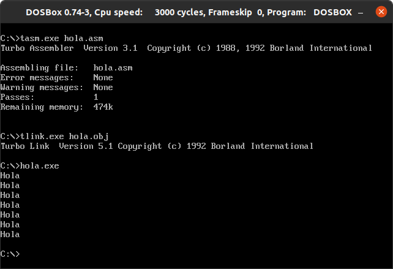

<h1>Sesión 1</h1>

<div style="text-align: justify">
Lo primero que haremos será instalar el emulador DOSBox que recrea un entorno similar al del sistema DOS, para ello solo será necesaria la ejecución de un comando en el terminal del sistema operativo anfitrión (Ubuntu 20.04 LTS):

```Bash
sudo apt-get install dosbox
```


Posteriormente añadimos las líneas necesarias al final del fichero de configuración de DOSBox para que de esta forma cada vez que se ejecute dicho emulador lo haga montando nuestro directorio de trabajo BIN con todos los ejecutables necesarios durante la realización de las prácticas:
</div>

```Bash
# ~/.dosbox/dosbox-0.74-3.conf


[autoexec]
# Lines in this section will be run at startup.
# You can put your MOUNT lines here.

#Teclado español
keyb sp

#Montamos nuestro directorio de trabajo en el disco C
mount C /home/luis/UNI/2/PIDH/PrácticasAUX/bc/BIN

#Nos movemos al disco C:
C:

#Limpiamos el terminal
cls
```
<div style="text-align: justify">
Para comprobar que todo funciona adecuadamente modificaré como se propone en el seminario el programa en ensamblador hola.asm de forma que este imprima 7 veces hola. Además he añadido un salto de línea al final de cada hola para mejorar la salida por pantalla quedando dicho fichero como se muestra:
</div>

```Bash
pila segment stack 'stack'
	dw 100h dup (?)
pila ends
datos segment 'data'
	msg db 'Hola',13,10,'$'
datos ends
codigo segment 'code'
	assume cs:codigo, ds:datos, ss:pila
	main PROC
		mov ax,datos
		mov ds,ax

		mov cl, 7

		bucle:
			mov dx,OFFSET msg
			mov ah,9
			int 21h

			dec cl
			jnz bucle


		mov ax,4C00h
		int 21h
	main ENDP
codigo ends

END main
```
<div style="text-align: justify">
Con respecto al hola.asm original, he movido 7 a CL que como se ha visto en el seminario es un registro de propósito general y funcionará como variable de control en nuestro bucle. Tras la etiqueta del bucle: insertamos el código que queremos que se ejecute en varias ocasiones y al final de este usando dec se disminuye en 1 la variable de control y comprueba que no es cero con jnz, en caso de que no lo sea la ejecución volverá a la etiqueta repitiendo el mismo código. Además de todo esto, en el mensaje de hola he añadido 13,10 que en decimal representa CRLF (marcador de nueva línea en sistemas DOS y Windows).
</div>

_ _ _ _

<div style="text-align:center"></div>

_ _ _ _
<div style="text-align: justify">
En la imagen de arriba tras hacer la compilación y el enlazado con los programas TASM.EXE y TLINK.EXE del paquete Turbo Assembler de Borland podemos observar la correcta ejecución de hola.asm.
</div>
