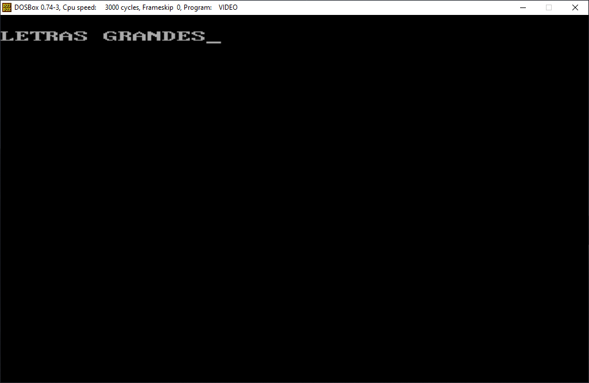

<h1>Sesión 2</h1>


Luis Miguel Aguilar González (https://github.com/laguilarg99/PDIH/)

Francisco Álvarez Terribas (https://github.com/Iqqdd99/PDIH)

<div style="text-align: justify">
Aprovechando la configuración del primer seminario del emulador DOSBOX vamos a realizar dos ejercicios en lenguaje c con la libraría dos.h, el primero trata de realizar un cambio del modo de video y el segundo llama a la función de interrupción correspondiente para la lectura de caracteres por teclado. 
</div>

<h3>Ejercicio 1</h3>
<h4>Cambio de modo de video</h4>
<div style="text-align: justify">
A continuación se puede ver la función encargada de realizar el cambio de modo vídeo:
</div>

```Bash
/* Selecciona el modo de video deseado */

void selecciona_modo_video(BYTE modo){
    union  REGS inregs, outregs;
    inregs.h.ah = 0x00;
    inregs.h.al = modo;
    int86(0x10, &inregs, &outregs);
}

```
<div style="text-align: justify">
En la siguiente captura de pantalla se puede ver como efetivamente se produce el cambio de modo de video:
</div>

_ _ _ _

<div style="text-align:center"></div>

_ _ _ _


<h3>Ejercicio 2</h3>
<h4>Lectura de caracteres por teclado</h4>
<div style="text-align: justify">
En este caso he realizado un bucle con la función de forma que toma todos los caracteres hasta pulsar la letra e:
</div>


```Bash
//Toma el caracter a imprimir
int mi_getchar(){
    union REGS inregs, outregs;
    int caracter;
    inregs.h.ah = 1;
    int86(0x21, &inregs, &outregs);
    caracter = outregs.h.al;
    return caracter;
}

//Imprime el caracter por pantalla
void mi_putchar(char c){
    union REGS inregs, outregs;
    inregs.h.ah = 2;
    inregs.h.dl = c;
    int86(0x21, &inregs, &outregs);
}

```

<div style="text-align: justify">
Como se puede observar el resultado de la ejecución:
</div>
_ _ _ _

<div style="text-align:center"></div>

_ _ _ _


