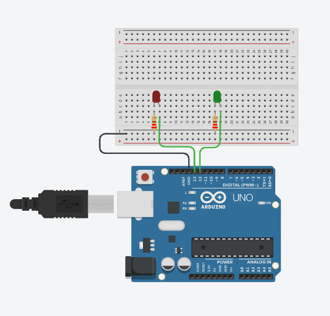
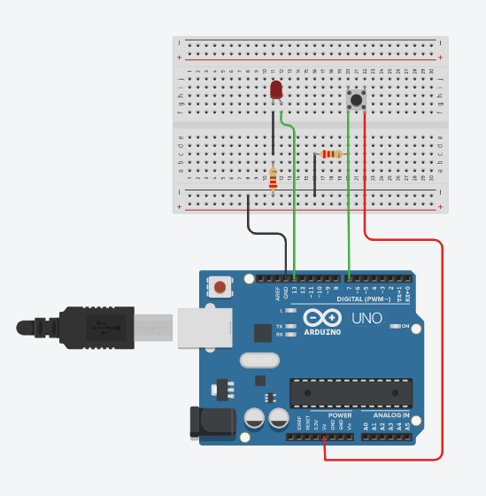

<h1>Seminario 3</h1>

Luis Miguel Aguilar González

Francisco Álvarez Terribas 

<div style="text-align: justify">
Este tercer seminario trata de enseñar como crear proyectos con el propio Arduino o con los distintos simuladores propuestos, en nuestro caso usaremos Tinkercad, para ello creamos una cuenta en su página web y una vez en nuestro perfil, nos vamos a la sección de circuitos para poder hacer nuestros propios diseños e implementar los ejercicios propuestos.<br/>

El primero trata simplemente de colocar 2 leds, uno rojo y otro verde a los puertos 13 y 12 para luego hacer que funcionen de forma intermitente, quedando el código y el circuito (en él se han usado dos leds de los colores indicados y 2 resistencias de 220 ohmios) como se muestra a continuación respectivamente:
</div>

<br/>

```C
void setup()
{
  pinMode(13, OUTPUT); //Pin de salida
  pinMode(12, OUTPUT); //Pin de salida
}

void loop()
{
  digitalWrite(13, HIGH);
  delay(1500); // Wait for 1000 millisecond(s)
  digitalWrite(13, LOW);
  delay(1500); // Wait for 1000 millisecond(s)
  digitalWrite(12, HIGH);
  delay(1500); // Wait for 1000 millisecond(s)
  digitalWrite(12, LOW);
  delay(1500); // Wait for 1000 millisecond(s)
}
```
<br/>

<div style="text-align: center"></div>

<br/>

_ _ _ _

<div style="text-align: justify">
El segundo ejercicio, trata de que a través del uso de un pulsador conectado al pin 7 del Arduino (declarado como entrada), se encienda un led, para la realización de dicho ejercicio hemos realizado el código y el circuito (en él se han usado el propio pulsador, el led que enciende y dos resistencias de 220 ohmios una para cada uno de los otros componentes indicados) que se proponen a continuación respectivamente:
</div>
<br/>


```C

void setup()
{
  pinMode(7, INPUT); //Pin de salida
  pinMode(13, OUTPUT); //Pin de salida
  
}

void loop()
{
  
  int val = digitalRead(7);
  digitalWrite(13,val);
  
}

```
<br/>

<div style="text-align: center"></div>


