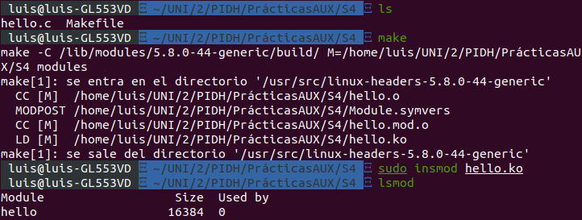
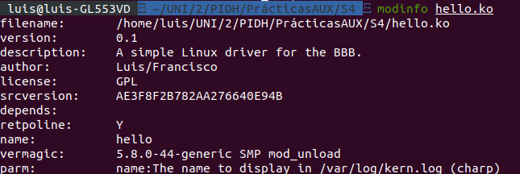
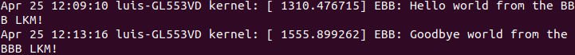

<h1>Seminario 4</h1>

Luis Miguel Aguilar González

Francisco Álvarez Terribas 

<div style="text-align: justify">
Este cuarto seminario trata de enseñar como crear módulos cargables para el núcleo, concretamente en linux.

Por ello, vamos a ver la programación de dichos módulos y como cargarlos al núcleo. 
Las cabeceras necesarias para la ejecución y compilación de dichos módulos ya están descargadas por defecto en linux.
Para comprobar todo lo aprendido hemos probado el módulo hello.c.
</div>

<br/>

```C
/**
 * @file    hello.c
 * @author  Derek Molloy
 * @date    4 April 2015
 * @version 0.1
 * @brief  An introductory "Hello World!" loadable kernel module (LKM) that can display a message
 * in the /var/log/kern.log file when the module is loaded and removed. The module can accept an
 * argument when it is loaded -- the name, which appears in the kernel log files.
 * @see http://www.derekmolloy.ie/ for a full description and follow-up descriptions.
*/

#include <linux/init.h>             // Macros used to mark up functions e.g., __init __exit
#include <linux/module.h>           // Core header for loading LKMs into the kernel
#include <linux/kernel.h>           // Contains types, macros, functions for the kernel

MODULE_LICENSE("GPL");              ///< The license type -- this affects runtime behavior
MODULE_AUTHOR("Luis/Francisco");      ///< The author -- visible when you use modinfo
MODULE_DESCRIPTION("A simple Linux driver for the BBB.");  ///< The description -- see modinfo
MODULE_VERSION("0.1");              ///< The version of the module

static char *name = "world";        ///< An example LKM argument -- default value is "world"
module_param(name, charp, S_IRUGO); ///< Param desc. charp = char ptr, S_IRUGO can be read/not changed
MODULE_PARM_DESC(name, "The name to display in /var/log/kern.log");  ///< parameter description

/** @brief The LKM initialization function
 *  The static keyword restricts the visibility of the function to within this C file. The __init
 *  macro means that for a built-in driver (not a LKM) the function is only used at initialization
 *  time and that it can be discarded and its memory freed up after that point.
 *  @return returns 0 if successful
 */
static int __init helloBBB_init(void){
   printk(KERN_INFO "EBB: Hello %s from the BBB LKM!\n", name);
   return 0;
}

/** @brief The LKM cleanup function
 *  Similar to the initialization function, it is static. The __exit macro notifies that if this
 *  code is used for a built-in driver (not a LKM) that this function is not required.
 */
static void __exit helloBBB_exit(void){
   printk(KERN_INFO "EBB: Goodbye %s from the BBB LKM!\n", name);
}

/** @brief A module must use the module_init() module_exit() macros from linux/init.h, which
 *  identify the initialization function at insertion time and the cleanup function (as
 *  listed above)
 */
module_init(helloBBB_init);
module_exit(helloBBB_exit);

```

<br/>

<div style="text-align: justify">
Compilamos el módulo y comprobamos que está cargado:

</div>


<br/>

<div style="text-align: center"></div>

<br/>

_ _ _ _


<br/>

<div style="text-align: justify">
Comprobamos la información del módulo:

</div>


<br/>

<div style="text-align: center"></div>

<br/>

_ _ _ _


<br/>

<div style="text-align: justify">
Eliminamos el módulo del sistema y comprobamos que ha funcionado en el log del kernel:

</div>


<br/>

<div style="text-align: center"></div>

<br/>

